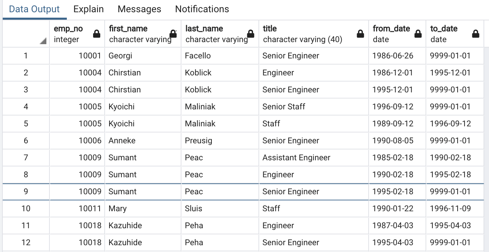
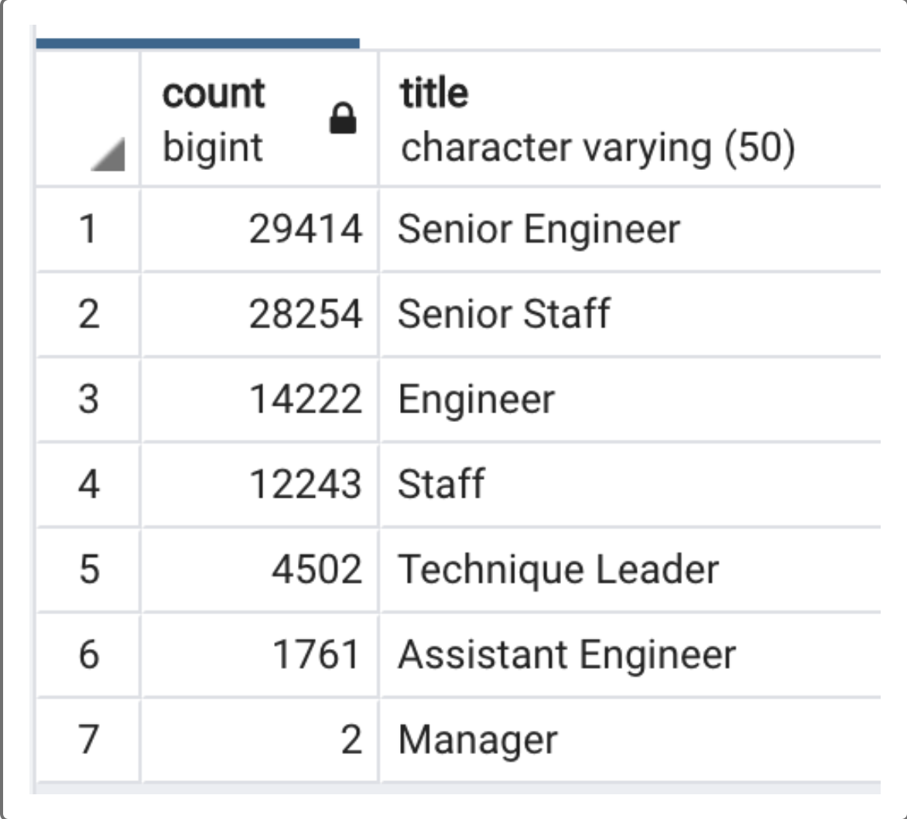
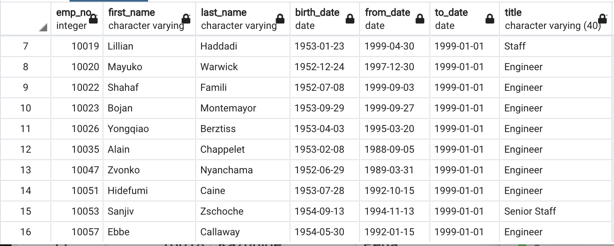
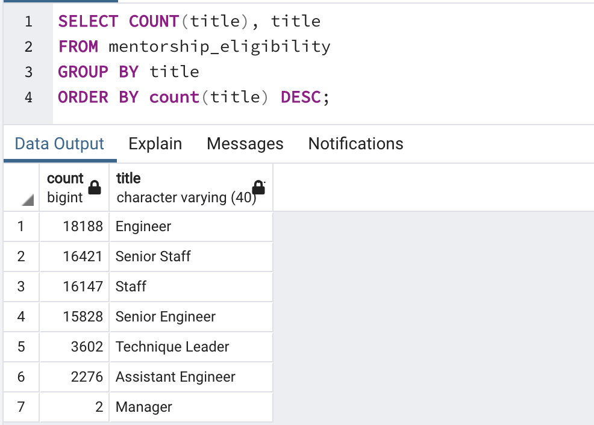

# Pewlett-Hackard-Analysis

## Project Overview 
Assisting a HR Analyst to determine the number of retiring employees per title, and identify employees eligible for a mentorship program. Analyzing the current and retiring employee data in order to prepare the company for an upcoming wave of retirement. 

## Results 
  - The retirement_titles table shows that several employees that are currently eligible for retirment, were promoted from Staff to Senior Staff and Engineer to Senior Engineer. Ideally, when they retire current staff and engineers could be trained and promoted to fill in those roles. 
  
  
  
  - The retiring_titles table shows the current titles of retiring employees, and the number of each title that will be retiring. This table shows that there will be a large outflow of Senior employees with 29,414 Senior Engineers, and 28,254 Senior Staff eligible for retirement. 
  
  - With 14222 Engineers and 12243 Staff eligible for retirment, there will also be a large outflow of Engineers and Staff. On the other hand, Only 2 Managers are eligible for retirement, hiring of new Managers may not be a top priority
  
  
  - A quick look at the mentorship_eligibility shows that there are several Engineers and Staff that are eligible for mentorship. Pewlett-Hackard would have to prioritise the mass mentorship of current employees 
  
  
## Summary 
The table below shows the employees eligible for membership grouped by their title. A comparison of this table to the retiring_titles table shows: 
  - If all 18,188 Engineers are successfully trained they could fill more than half of the 29,414 Senior Engineer roles that would be vacant after retirement.
  - If all 16,421 Staff  are successfully trained they could fill more than half of the 28,254 Senior Staff roles that would be vacant after retirement
  - If all 2,276 Assistant Engineers are successfully trained they could fill some of Engineer roles after 14,222 Engineer are retired 
  - Additionally, Pewlett-Hackard will need to prepare to fill 12,243 Staff roles, 4502 Technique Leader roles, 1761 Assistant Manager roles, and 2 Manager roles

Mentorship:
  - With 29,414 Senior Engineers eligible for retirement and 18,188 Engineers eligible for mentorship, there is more than enough mentors available for Engineers
  - With 28,254 Senior Staff eligible for retirement and 16,421 Staff eligible for mentorship, there is more than enough mentors available for Staff
  - With 14,222 Engineers eligible for retirement and 2,276 Assistant Engineers eligible for mentorship, there is more than enough mentors available for Assistant Engineers 
  - The remaining Senior Engineers, Senior Staff, and Engineers may be able to asssist in mentorship of the Senior Engineers, Technique Leaders, and Managers that are eligible for mentorship 

 
  
  
